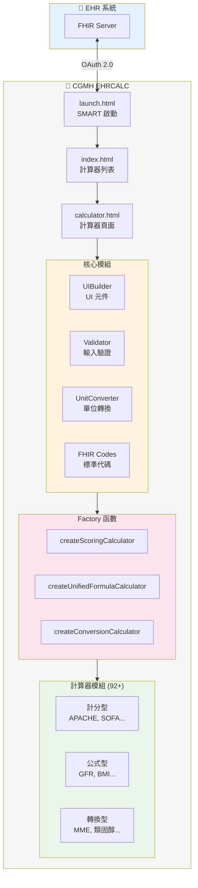
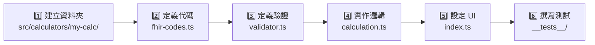

# 🏥 CGMH EHRCALC on FHIR

A comprehensive SMART on FHIR application providing **92 clinical calculators** for healthcare professionals, inspired by MDCalc. This application integrates seamlessly with Electronic Health Records (EHR) to provide automated patient data population and clinical decision support.

## ✨ Features

### 🧮 **92 Clinical Calculators**

- **Cardiovascular Risk Assessment**: ASCVD, Framingham, GRACE ACS, etc.
- **Renal Function**: CKD-EPI, MDRD, Cockcroft-Gault, etc.
- **Critical Care Scoring**: APACHE II, SOFA, qSOFA, etc.
- **Drug Conversion**: Benzodiazepine, Steroid, MME calculators
- **Pediatric Tools**: Growth Charts, APGAR, PECARN, etc.
- **Infection Assessment**: CURB-65, SIRS, Bacterial Meningitis Score, etc.

### 🔗 **SMART on FHIR Integration**

- Automatic patient data population from EHR
- Real-time lab value retrieval
- Seamless integration with clinical workflows

### 🎨 **Modern User Interface**

- **Responsive Design**: Works on desktop, tablet, and mobile
- **Sticky Header**: Patient info and search always visible
- **Advanced Search & Sort**: Find calculators quickly with A-Z, Z-A sorting
- **Beautiful UI**: Modern gradient design with smooth animations

### 📊 **Enhanced Calculator Features**

- **Formula Display**: Mathematical formulas with detailed explanations
- **Reference Materials**: Citations and clinical images
- **Normal Value Ranges**: Built-in reference ranges
- **Clinical Notes**: Important usage guidelines

## 🚀 How to Run

### Method 1: Docker (推薦 / Recommended) 🐳

**最簡單的方式 - 一鍵啟動！**

```bash
# Windows
.\start-docker.ps1

# Linux/Mac
chmod +x start-docker.sh
./start-docker.sh

# 或使用 Docker Compose
docker-compose up -d
```

訪問：**http://localhost:8080**

#### 🔄 更新 Docker 容器（包含最新檔案）

如果您遇到 404 錯誤或需要更新容器：

```powershell
# Windows - 自動重建並啟動
.\rebuild-docker.ps1

# 或手動執行
docker-compose down
docker-compose build --no-cache
docker-compose up -d
```

#### 🏥 透過 SMART on FHIR 啟動

1. **確保容器正在運行**

    ```bash
    docker ps  # 應看到 medcalcehr-app
    ```

2. **訪問健康檢查頁面**
    - http://localhost:8080/health-check.html

3. **使用 SMART Health IT Launcher 測試**
    - 前往：https://launch.smarthealthit.org/
    - App Launch URL: `http://localhost:8080/launch.html`
    - 或使用您的 IP: `http://YOUR_IP:8080/launch.html`
    - FHIR Version: **R4 (FHIR 4.0.1)**
    - 選擇測試病患並點擊 **"Launch App!"**

4. **詳細設定指南**
    - 參考：[SMART_LAUNCH_GUIDE.md](SMART_LAUNCH_GUIDE.md)

#### 🔍 檢查清單

- ✅ Docker 容器運行中：`docker ps`
- ✅ 可訪問首頁：http://localhost:8080
- ✅ 可訪問啟動頁：http://localhost:8080/launch.html
- ✅ 健康檢查通過：http://localhost:8080/health-check.html
- ✅ 計算器測試通過：http://localhost:8080/test-calculators.html

#### 🧪 測試所有計算器

自動化測試工具可以驗證所有 91 個計算器模組：

```
http://localhost:8080/test-calculators.html
```

**功能**：

- ✅ 自動測試所有計算器載入
- ✅ 驗證模組結構和必要方法
- ✅ 即時顯示測試進度和結果
- ✅ 可篩選成功/失敗項目
- ✅ 可匯出 JSON 格式報告
- ✅ 單個計算器重新測試

詳細說明：[計算器測試指南](CALCULATOR_TESTING_GUIDE.md)

#### 🎨 統一樣式系統

所有計算器現在使用統一的樣式系統，確保一致的使用者體驗：

**新功能**：

- ✅ 預定義的 UI 組件庫（輸入、按鈕、結果顯示）
- ✅ 統一的顏色方案和風險指標
- ✅ 響應式設計（手機、平板、桌面）
- ✅ 無障礙支援
- ✅ 列印友好樣式

**開發指南**：

- 快速參考：[UNIFIED_STYLE_QUICK_REF.md](UNIFIED_STYLE_QUICK_REF.md)
- 完整指南：[CALCULATOR_STYLE_GUIDE.md](CALCULATOR_STYLE_GUIDE.md)
- CSS 檔案：`css/unified-calculator.css`

**範例組件**：

<details>
<summary>點擊查看基本範本</summary>

```javascript
export const exampleCalculator = {
    generateHTML: function () {
        return `
            <!-- 標題 -->
            <div class="calculator-header">
                <h3>${this.title}</h3>
                <p class="description">計算器說明</p>
            </div>
            
            <!-- 輸入 -->
            <div class="input-group">
                <label for="age">Age:</label>
                <input type="number" id="age">
            </div>
            
            <!-- 按鈕 -->
            <button class="btn-calculate">Calculate</button>
            
            <!-- 結果 -->
            <div class="result-container" style="display: none;">
                <div class="result-score">
                    <span class="result-score-value">24.5</span>
                    <span class="result-score-unit">kg/m²</span>
                </div>
                <div class="risk-badge low">Low Risk</div>
            </div>
        `;
    }
};
```

</details>

📖 詳細說明請參考 [Docker 部署指南](README_DOCKER.md)

### Method 2: Python HTTP Server

1. Navigate to the project directory
2. Start a local web server:

    ```bash
    # Python 3
    python -m http.server 8000

    # Python 2
    python -m SimpleHTTPServer 8000
    ```

### Method 3: Node.js HTTP Server

```bash
npx http-server -p 8000
```

### Method 4: Live Server (VS Code Extension)

1. Install the "Live Server" extension in VS Code
2. Right-click on `launch.html` and select "Open with Live Server"

## 🔧 SMART on FHIR Setup

1. **Start your local server** (using any method above)
2. **Go to SMART Health IT Launcher**: [https://launch.smarthealthit.org/](https://launch.smarthealthit.org/)
3. **Configure the launcher**:
    - **App Launch URL**: `http://localhost:8000/launch.html`
    - **Select a patient** from the available test patients
4. **Launch the application**

## 📱 Usage

### 🔍 **Finding Calculators**

- Use the **search bar** to find specific calculators
- **Sort options**: A→Z, Z→A, Recently Added, Most Used
- **Browse by category**: All calculators are alphabetically organized

### 📋 **Using Calculators**

- Patient data is **automatically populated** from the EHR
- **Manual input** available for all fields
- **Real-time calculations** with immediate results
- **Formula explanations** and clinical guidance provided

### 📊 **Special Features**

- **Growth Charts**: Side-by-side height/weight visualization
- **Reference Images**: Clinical scoring tables and diagrams
- **Formula Sections**: Mathematical explanations with normal values

## 🛠️ Technical Stack

| 類別          | 技術                               |
| ------------- | ---------------------------------- |
| **語言**      | TypeScript, HTML5, CSS3            |
| **FHIR 整合** | SMART on FHIR JavaScript Client    |
| **圖表**      | Chart.js（生長曲線圖）             |
| **架構**      | 模組化計算器系統 + Factory Pattern |
| **UI 系統**   | UIBuilder 元件庫                   |
| **驗證**      | 三級驗證系統（綠/黃/紅）           |
| **代碼標準**  | LOINC、SNOMED CT、RxNorm           |
| **部署**      | Docker + Nginx                     |
| **測試**      | Jest + SaMD 驗證                   |

### 🏗️ 系統架構



## 📁 Project Structure

```
MEDCALCEHR/
├── index.html                    # 主頁（計算器列表）
├── calculator.html               # 計算器頁面
├── launch.html                   # SMART on FHIR 啟動頁
│
├── src/                          # TypeScript 原始碼
│   ├── fhir-codes.ts             # LOINC/SNOMED 代碼定義
│   ├── validator.ts              # 輸入驗證規則
│   ├── ui-builder.ts             # UI 元件建構器
│   ├── unit-converter.ts         # 單位轉換器
│   ├── lab-name-mapping.ts       # 檢驗名稱對照
│   │
│   ├── calculators/              # 計算器模組
│   │   ├── shared/               # 共用 Factory 函數
│   │   │   ├── scoring-calculator.ts
│   │   │   ├── unified-formula-calculator.ts
│   │   │   └── conversion-calculator.ts
│   │   ├── apache-ii/            # APACHE II
│   │   ├── ckd-epi/              # CKD-EPI GFR
│   │   └── ...                   # 其他 90+ 計算器
│   │
│   ├── types/                    # TypeScript 型別定義
│   └── __tests__/                # 測試檔案
│
├── js/                           # 編譯後的 JavaScript
├── css/                          # 樣式檔案
│   ├── main.css                  # 主樣式
│   ├── unified-calculator.css    # 統一計算器樣式
│   └── components/               # 元件樣式
│
├── docs/                         # 開發文件
│   └── DEVELOPER_GUIDE.md        # 開發者指南
│
└── text/                         # 其他文件
    ├── UI_BUILDER_GUIDE.md
    └── CALCULATOR_STYLE_GUIDE.md
```

## 🔄 Recent Updates

- ✅ **Fixed Charlson Calculator**: Resolved `codes.join is not a function` error
- ✅ **Enhanced Growth Charts**: Side-by-side height/weight display with optimized space usage
- ✅ **Sticky Header**: Patient info and search remain visible while scrolling
- ✅ **Advanced Sorting**: Multiple sort options for calculator list
- ✅ **Formula Displays**: Added mathematical formulas with explanations
- ✅ **Reference Materials**: Integrated clinical images and citations

## 🏥 Clinical Calculators Included

<details>
<summary>View all 92 calculators</summary>

- 2HELPS2B Score for Seizure Risk
- 4 A's Test for Delirium
- 4C Mortality Score for COVID-19
- 4-Level Pulmonary Embolism Clinical Probability Score (4PEPS)
- 4Ts Score for Heparin-Induced Thrombocytopenia (HIT)
- 6-Minute Walk Distance (6MWD) Calculator
- ABG Analyzer
- ABL90 FLEX Analyzer Calculator
- ACTION-ICU Risk Score for Intensive Care in NSTEMI
- APACHE II Score
- APGAR Score
- ARISCAT Score for Postoperative Pulmonary Complications
- ASCVD Risk Score (10-Year)
- Atrial Fibrillation (AF) Risk Score (AHEAD)
- Bacterial Meningitis Score for Children
- Benzodiazepine Conversion Calculator
- BMI and BSA Calculator
- BWPS for Thyrotoxicosis
- Caprini Score for VTE Risk
- Centor Score for Strep Pharyngitis
- Charlson Comorbidity Index (CCI)
- Child-Pugh Score for Cirrhosis Mortality
- CIWA-Ar for Alcohol Withdrawal
- CKD-EPI GFR (2021)
- Clinical Pulmonary Infection Score (CPIS) for VAP
- Cockcroft-Gault Creatinine Clearance
- Corrected Calcium for Hypoalbuminemia
- Corrected Phenytoin for Hypoalbuminemia
- Corrected QT Interval (QTc)
- Corrected Sodium for Hyperglycemia
- Corticosteroid Conversion Calculator
- CURB-65 Score for Pneumonia Severity
- Duke Activity Status Index (DASI)
- Due Date Calculator
- Ethanol Concentration Conversion
- ETT Depth and Tidal Volume Calculator
- FIB-4 Score for Liver Fibrosis
- Fractional Excretion of Sodium (FENa)
- Framingham Risk Score for Coronary Heart Disease
- Free Water Deficit in Hypernatremia
- Friedewald Equation for LDL Cholesterol
- GAD-7 for Anxiety
- GARFIELD-AF Risk Score
- Geneva Score (Revised) for Pulmonary Embolism
- Glasgow Coma Scale (GCS)
- GRACE ACS Risk Score
- Gupta Perioperative Cardiac Risk (MICA)
- GWTG-HF Risk Score
- HAS-BLED Score for Major Bleeding Risk
- HEART Score for Major Cardiac Events
- HOMA-IR for Insulin Resistance
- HScore for Hemophagocytic Lymphohistiocytosis (HLH)
- Ideal Body Weight (IBW) Calculator
- Intraoperative Fluid Dosing Calculator
- ISTH Criteria for DIC
- Kawasaki Disease Diagnostic Criteria
- MAGGIC Risk Calculator for Heart Failure
- Maintenance Fluids Calculator
- Mean Arterial Pressure (MAP)
- MDRD GFR Equation
- MELD-Na Score for Liver Disease Severity
- Morphine Milligram Equivalent (MME) Calculator
- NAFLD Fibrosis Score
- NIH Stroke Scale (NIHSS)
- Padua Prediction Score for VTE Risk
- PECARN Head Trauma Rule for Children
- Pediatric Growth Chart
- PERC Rule for Pulmonary Embolism
- PHQ-9 for Depression
- QRISK3-Based CVD Risk (UK)
- qSOFA Score for Sepsis
- Ranson Criteria for Pancreatitis Mortality
- RegiSCAR Score for DRESS
- Revised Cardiac Risk Index (RCRI)
- SCORE2-Diabetes for 10-Year CVD Risk
- Serum Anion Gap
- Serum Osmolality
- SEX-SHOCK Risk Score for Cardiogenic Shock
- SIRS Criteria for Systemic Inflammatory Response
- SOFA Score for Sepsis Organ Failure
- STOP-BANG for Obstructive Sleep Apnea
- TIMI Risk Score for UA/NSTEMI
- tPA Dosing for Acute Stroke
- tPA Dosing for PE and MI
- Transtubular Potassium Gradient (TTKG)
- Wells Criteria for DVT
- Wells Criteria for PE

</details>

## 👨‍💻 Developer Guide

### 🚨 開發規則 (Development Rules)

建立新計算器時，請遵守以下 **SaMD (Software as a Medical Device)** 合規要求：

| 規則               | 說明                                                    |
| ------------------ | ------------------------------------------------------- |
| **必須有臨床代碼** | 每個數值輸入必須有對應的標準代碼（LOINC/SNOMED/RxNorm） |
| **必須有驗證規則** | 每個數值輸入必須定義驗證規則（綠/黃/紅區間）            |
| **禁止原始 HTML**  | 使用 `uiBuilder` 或 Factory 函數，不可自行撰寫 HTML     |
| **必須有測試**     | 每個計算器必須有對應的測試檔案驗證                      |

### 🏭 選擇正確的 Factory

| 計算器類型   | Factory 函數                     | 檔案位置                                               |
| ------------ | -------------------------------- | ------------------------------------------------------ |
| **計分型**   | `createScoringCalculator`        | `src/calculators/shared/scoring-calculator.ts`         |
| **公式型**   | `createUnifiedFormulaCalculator` | `src/calculators/shared/unified-formula-calculator.ts` |
| **單位轉換** | `createConversionCalculator`     | `src/calculators/shared/conversion-calculator.ts`      |

### 📝 建立新計算器步驟



### 🧪 必要測試案例

- **TC-001**: 標準計算驗證
- **TC-002**: 風險分級驗證
- **TC-003**: 邊界值測試
- **TC-004**: 無效輸入處理
- **TC-005**: Golden Dataset 驗證

### 📚 開發文件

| 文件                                                            | 說明               |
| --------------------------------------------------------------- | ------------------ |
| [DEVELOPER_GUIDE.md](docs/DEVELOPER_GUIDE.md)                   | 完整開發指南       |
| [UI_BUILDER_GUIDE.md](text/UI_BUILDER_GUIDE.md)                 | UIBuilder 使用指南 |
| [CALCULATOR_STYLE_GUIDE.md](text/CALCULATOR_STYLE_GUIDE.md)     | 樣式指南           |
| [CALCULATOR_TESTING_GUIDE.md](text/CALCULATOR_TESTING_GUIDE.md) | 測試指南           |

### ✅ 開發檢查清單

```
□ 每個數值輸入都有 loincCode？
□ 每個數值輸入都有 validationType？
□ 缺少的代碼已加入 fhir-codes.ts？
□ 缺少的驗證規則已加入 validator.ts？
□ 使用 uiBuilder / Factory（無原始 HTML）？
□ 有測試檔案驗證計算邏輯？
```

---

## 🤝 Contributing

Contributions are welcome! Please feel free to submit issues, feature requests, or pull requests.

在提交 PR 之前，請確保：

1. ✅ 遵循開發規則
2. ✅ 所有測試通過
3. ✅ 程式碼經過 linting
4. ✅ 新功能有對應文件

## 📄 License

This project is open source and available under the [MIT License](LICENSE).

## 🏥 About CGMH

Chang Gung Memorial Hospital (CGMH) is one of Taiwan's largest medical centers, committed to providing excellent healthcare services and advancing medical technology.
