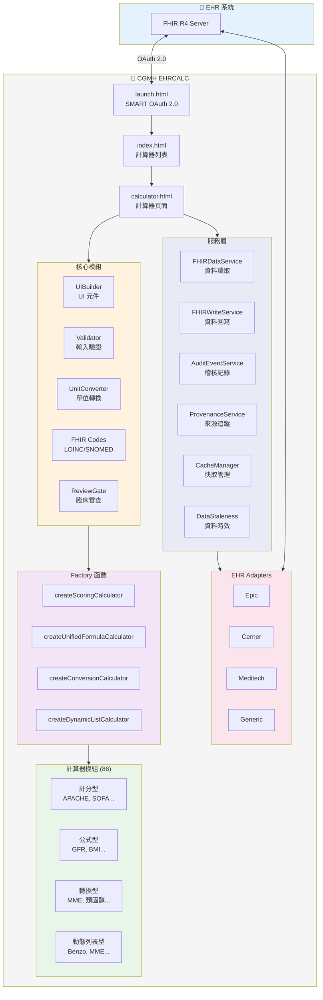
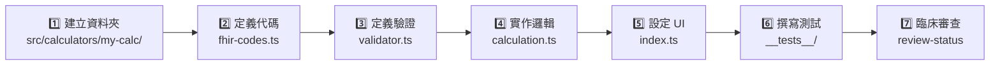

# 🏥 CGMH EHRCALC on FHIR

A comprehensive SMART on FHIR application providing **86 clinical calculators** across **14 medical specialties** for healthcare professionals, inspired by MDCalc. This application integrates seamlessly with Electronic Health Records (EHR) to provide automated patient data population and clinical decision support, with built-in **SaMD (Software as a Medical Device)** compliance infrastructure.

## ✨ Features

### 🧮 **86 Clinical Calculators**

- **Cardiovascular (21)**: ASCVD, Framingham (LDL), GRACE ACS, HEART, RCRI, Wells DVT/PE, etc.
- **Renal (6)**: CKD-EPI, MDRD, Cockcroft-Gault, FENa, FEUrea, TTKG
- **Critical Care (5)**: APACHE II, SOFA, qSOFA, SIRS, MEWS
- **Drug Conversion (3)**: Benzodiazepine, Steroid, MME Calculators
- **Pediatric (6)**: Growth Charts (CDC + Taiwan), APGAR, PECARN, Kawasaki, Pediatric BP
- **Infection (4)**: CURB-65, Centor, CPIS, 4C Mortality COVID-19
- **Neurology (6)**: GCS, NIHSS, 2HELPS2B, 4A's Delirium, tPA Dosing Stroke
- **Respiratory (7)**: ABG Analyzer, ABL90 FLEX, ARISCAT, 6MWD, ETT, STOP-BANG
- **Metabolic (6)**: Calcium/Sodium Correction, Serum Osmolality, Anion Gap, HOMA-IR, BWPS
- **Hematology (3)**: 4Ts HIT, HScore HLH, ISTH DIC
- **Gastroenterology (4)**: Child-Pugh, FIB-4, MELD-Na, NAFLD Fibrosis, Ranson
- **Obstetrics (1)**: Due Date Calculator
- **Psychiatry (3)**: PHQ-9, GAD-7, CIWA-Ar
- **General Medicine (7)**: BMI/BSA, Charlson, IBW, MAP, RegSCAR, Intraop Fluid, ABL90

### 🔗 **SMART on FHIR Integration**

- Automatic patient data population from EHR
- Real-time lab value retrieval via FHIR R4
- FHIR write-back and provenance tracking
- Multi-EHR adapter support (Epic, Cerner, Meditech, Generic)
- OAuth 2.0 authentication flow

### 🛡️ **SaMD Compliance Infrastructure**

- **Clinical Review Gating**: Calculators require clinical review approval before production use
- **Review Status Tracking**: approved / conditional / pending / rejected workflow
- **Audit Event Service**: FHIR AuditEvent logging for all calculator operations
- **Provenance Service**: FHIR Provenance resource creation for traceability
- **Security Labels**: Data classification and access control
- **TFDA/IEC 62304 Documentation**: Complete regulatory compliance documentation set

### 🎨 **Modern User Interface**

- **Responsive Design**: Works on desktop, tablet, and mobile
- **Sticky Header**: Patient info and search always visible
- **Advanced Search**: Fuzzy search with Fuse.js + A-Z, Z-A sorting
- **Theme System**: Default, Tech, and High-Contrast themes
- **i18n Support**: English and Traditional Chinese (zh-TW)
- **Swipe Navigation**: Touch gesture support for mobile devices
- **Accessibility**: Skip links, ARIA labels, keyboard navigation

### 📊 **Enhanced Calculator Features**

- **Formula Display**: Mathematical formulas with detailed explanations
- **Reference Materials**: Citations and clinical images
- **Normal Value Ranges**: Built-in reference ranges with 3-tier validation (green/yellow/red)
- **Data Staleness Detection**: Warns when auto-populated data is outdated
- **Calculation History**: Track and review past calculations
- **Favorites**: Save frequently used calculators
- **Cross-field Validation**: Complex inter-field validation rules

## 🚀 How to Run

### Method 1: Docker (推薦 / Recommended) 🐳

**最簡單的方式 - 一鍵啟動！**

```bash
# Windows
.\start-docker.ps1

# Linux/Mac
chmod +x start-docker.sh
./start-docker.sh

# 或使用 Docker Compose
docker-compose up -d
```

訪問：**http://localhost:8080**

#### 🔄 更新 Docker 容器（包含最新檔案）

如果您遇到 404 錯誤或需要更新容器：

```powershell
# Windows - 自動重建並啟動
.\rebuild-docker.ps1

# 或手動執行
docker-compose down
docker-compose build --no-cache
docker-compose up -d
```

#### 🏥 透過 SMART on FHIR 啟動

1. **確保容器正在運行**

    ```bash
    docker ps  # 應看到 medcalcehr-app
    ```

2. **訪問健康檢查頁面**
    - http://localhost:8080/health-check.html

3. **使用 SMART Health IT Launcher 測試**
    - 前往：https://launch.smarthealthit.org/
    - App Launch URL: `http://localhost:8080/launch.html`
    - 或使用您的 IP: `http://YOUR_IP:8080/launch.html`
    - FHIR Version: **R4 (FHIR 4.0.1)**
    - 選擇測試病患並點擊 **"Launch App!"**

4. **詳細設定指南**
    - 參考：[SMART_LAUNCH_GUIDE.md](SMART_LAUNCH_GUIDE.md)

#### 🔍 檢查清單

- ✅ Docker 容器運行中：`docker ps`
- ✅ 可訪問首頁：http://localhost:8080
- ✅ 可訪問啟動頁：http://localhost:8080/launch.html
- ✅ 健康檢查通過：http://localhost:8080/health-check.html
- ✅ 計算器測試通過：http://localhost:8080/test-calculators.html

#### 🧪 測試所有計算器

自動化測試工具可以驗證所有計算器模組：

```
http://localhost:8080/test-calculators.html
```

**功能**：

- ✅ 自動測試所有計算器載入
- ✅ 驗證模組結構和必要方法
- ✅ 即時顯示測試進度和結果
- ✅ 可篩選成功/失敗項目
- ✅ 可匯出 JSON 格式報告
- ✅ 單個計算器重新測試

詳細說明：[計算器測試指南](CALCULATOR_TESTING_GUIDE.md)

📖 詳細說明請參考 [Docker 部署指南](README_DOCKER.md)

### Method 2: Vite Dev Server (開發推薦)

```bash
npm install
npm run dev
```

### Method 3: Python HTTP Server

```bash
# Python 3
python -m http.server 8000
```

### Method 4: Node.js HTTP Server

```bash
npx http-server -p 8000
```

### Method 5: Live Server (VS Code Extension)

1. Install the "Live Server" extension in VS Code
2. Right-click on `launch.html` and select "Open with Live Server"

## 🔧 SMART on FHIR Setup

1. **Start your local server** (using any method above)
2. **Go to SMART Health IT Launcher**: [https://launch.smarthealthit.org/](https://launch.smarthealthit.org/)
3. **Configure the launcher**:
    - **App Launch URL**: `http://localhost:8000/launch.html`
    - **Select a patient** from the available test patients
4. **Launch the application**

## 📱 Usage

### 🔍 **Finding Calculators**

- Use the **search bar** to find specific calculators (fuzzy search supported)
- **Sort options**: A→Z, Z→A, Recently Added, Most Used
- **Category filter**: Filter by 14 medical specialties
- **Favorites**: Pin frequently used calculators

### 📋 **Using Calculators**

- Patient data is **automatically populated** from the EHR
- **Manual input** available for all fields
- **Real-time calculations** with immediate results
- **Formula explanations** and clinical guidance provided
- **Data staleness indicators** warn about outdated values

### 📊 **Special Features**

- **Growth Charts**: Side-by-side height/weight visualization with CDC + Taiwan data
- **Trade-off Analysis**: Bleeding vs. Ischemic risk visualization
- **Reference Images**: Clinical scoring tables and diagrams
- **Formula Sections**: Mathematical explanations with normal values

## 🛠️ Technical Stack

| 類別           | 技術                                          |
| -------------- | --------------------------------------------- |
| **語言**       | TypeScript 5.9, HTML5, CSS3                   |
| **建置工具**   | Vite 6.2 (code splitting, lazy loading)       |
| **FHIR 整合**  | fhirclient 2.6 (SMART on FHIR R4)            |
| **圖表**       | Chart.js 4.4（生長曲線圖）                    |
| **搜尋**       | Fuse.js 7.1（模糊搜尋）                       |
| **錯誤追蹤**   | Sentry 9.5                                    |
| **效能監控**   | web-vitals 4.2                                |
| **架構**       | 模組化計算器系統 + Factory Pattern + Adapters |
| **UI 系統**    | UIBuilder 元件庫 + BEM CSS Architecture       |
| **驗證**       | 三級驗證系統（綠/黃/紅）+ 跨欄位驗證         |
| **代碼標準**   | LOINC、SNOMED CT、RxNorm                      |
| **i18n**       | English, 繁體中文 (zh-TW)                     |
| **部署**       | Docker + Nginx (rate limiting, TLS)           |
| **單元測試**   | Jest 29 + ts-jest + jest-axe (114 test files) |
| **E2E 測試**   | Playwright 1.58 (7 test specs)                |
| **程式碼品質** | ESLint + Prettier + Husky + lint-staged       |
| **合規**       | TFDA/IEC 62304 SaMD 驗證                      |

### 🏗️ 系統架構


```mermaid
flowchart TB
    subgraph EHR["🏥 EHR 系統"]
        FHIR["FHIR R4 Server"]
    end

    subgraph App["📱 CGMH EHRCALC"]
        direction TB
        Launch["launch.html<br/>SMART OAuth 2.0"]
        Index["index.html<br/>計算器列表"]
        Calc["calculator.html<br/>計算器頁面"]

        subgraph Core["核心模組"]
            UIBuilder["UIBuilder<br/>UI 元件"]
            Validator["Validator<br/>輸入驗證"]
            UnitConv["UnitConverter<br/>單位轉換"]
            FHIRCodes["FHIR Codes<br/>LOINC/SNOMED"]
            ReviewGate["ReviewGate<br/>臨床審查"]
        end

        subgraph Services["服務層"]
            FHIRData["FHIRDataService<br/>資料讀取"]
            FHIRWrite["FHIRWriteService<br/>資料回寫"]
            AuditSvc["AuditEventService<br/>稽核記錄"]
            Provenance["ProvenanceService<br/>來源追蹤"]
            Cache["CacheManager<br/>快取管理"]
            Staleness["DataStaleness<br/>資料時效"]
        end

        subgraph Adapters["EHR Adapters"]
            Epic["Epic"]
            Cerner["Cerner"]
            Meditech["Meditech"]
            Generic["Generic"]
        end

        subgraph Calculators["計算器模組 (86)"]
            Scoring["計分型<br/>APACHE, SOFA..."]
            Formula["公式型<br/>GFR, BMI..."]
            Convert["轉換型<br/>MME, 類固醇..."]
            DynList["動態列表型<br/>Benzo, MME..."]
        end

        subgraph Factories["Factory 函數"]
            SF["createScoringCalculator"]
            FF["createUnifiedFormulaCalculator"]
            CF["createConversionCalculator"]
            DF["createDynamicListCalculator"]
        end
    end

    FHIR <-->|"OAuth 2.0"| Launch
    FHIR <--> Adapters
    Launch --> Index
    Index --> Calc
    Calc --> Core
    Calc --> Services
    Services --> Adapters
    Core --> Factories
    Factories --> Calculators

    style EHR fill:#e3f2fd
    style App fill:#f5f5f5
    style Core fill:#fff3e0
    style Services fill:#e8eaf6
    style Adapters fill:#fce4ec
    style Calculators fill:#e8f5e9
    style Factories fill:#f3e5f5
```

## 📁 Project Structure

```
MEDCALCEHR/
├── index.html                    # 主頁（計算器列表）
├── calculator.html               # 計算器頁面
├── launch.html                   # SMART on FHIR 啟動頁
├── health-check.html             # 系統健康檢查
├── test-calculators.html         # 自動化計算器測試
│
├── src/                          # TypeScript 原始碼
│   ├── main.ts                   # 應用程式進入點
│   ├── calculator-page.ts        # 計算器頁面渲染
│   ├── fhir-launch.ts            # SMART OAuth 流程
│   │
│   ├── # ── 核心模組 ──
│   ├── ui-builder.ts             # UI 元件建構器
│   ├── validator.ts              # 輸入驗證規則（三級）
│   ├── unit-converter.ts         # 單位轉換器
│   ├── fhir-codes.ts             # LOINC/SNOMED 代碼定義
│   ├── lab-name-mapping.ts       # 檢驗名稱對照
│   ├── review-gate.ts            # 臨床審查閘門
│   ├── calculator-review-status.json  # 審查狀態登錄
│   │
│   ├── # ── 服務層 ──
│   ├── fhir-data-service.ts      # FHIR 資料讀取
│   ├── fhir-write-service.ts     # FHIR 資料回寫
│   ├── fhir-feedback.ts          # FHIR 操作回饋
│   ├── audit-event-service.ts    # 稽核事件服務
│   ├── provenance-service.ts     # 來源追蹤服務
│   ├── security-labels-service.ts # 安全標籤服務
│   ├── cache-manager.ts          # 客戶端快取
│   ├── data-staleness.ts         # 資料時效追蹤
│   ├── calculation-history.ts    # 計算歷史記錄
│   ├── favorites.ts              # 使用者收藏
│   ├── session-manager.ts        # Session 逾時管理
│   ├── security.ts               # 安全控制
│   ├── logger.ts                 # 日誌基礎設施
│   ├── sentry.ts                 # 錯誤追蹤 (Sentry)
│   ├── web-vitals.ts             # 效能監控
│   │
│   ├── # ── UI 增強 ──
│   ├── fuzzy-search.ts           # 模糊搜尋 (Fuse.js)
│   ├── language-toggle.ts        # 語言切換 (i18n)
│   ├── theme-toggle.ts           # 佈景主題切換
│   ├── swipe-navigation.ts       # 觸控手勢導覽
│   ├── lazyLoader.ts             # 懶載入管理
│   │
│   ├── calculators/              # 計算器模組
│   │   ├── index.ts              # 計算器登錄與載入
│   │   ├── shared/               # 共用 Factory 函數
│   │   │   ├── scoring-calculator.ts
│   │   │   ├── unified-formula-calculator.ts
│   │   │   ├── conversion-calculator.ts
│   │   │   ├── dynamic-list-calculator.ts
│   │   │   └── fhir-integration.ts
│   │   ├── ascvd/                # ASCVD Risk Score
│   │   ├── ckd-epi/              # CKD-EPI GFR
│   │   ├── growth-chart/         # 生長曲線（CDC + Taiwan）
│   │   └── ...                   # 其他 83 個計算器
│   │
│   ├── ehr-adapters/             # EHR 系統適配器
│   │   ├── base-adapter.ts       # 基礎適配器
│   │   ├── epic-adapter.ts       # Epic EHR
│   │   ├── cerner-adapter.ts     # Cerner EHR
│   │   ├── meditech-adapter.ts   # Meditech EHR
│   │   └── generic-adapter.ts    # 通用 FHIR
│   │
│   ├── i18n/                     # 國際化
│   │   ├── locales/
│   │   │   ├── en.json           # English
│   │   │   └── zh-TW.json        # 繁體中文
│   │   └── index.ts
│   │
│   ├── types/                    # TypeScript 型別定義
│   │   ├── calculator-base.ts    # 基礎計算器型別
│   │   ├── calculator-formula.ts # 公式型計算器型別
│   │   ├── calculator-scoring.ts # 計分型計算器型別
│   │   └── calculator-specialized.ts # 特化型別
│   │
│   ├── __tests__/                # 單元測試（114 files）
│   └── test-utils/               # 測試工具
│
├── js/                           # 編譯後的 JavaScript
├── css/                          # 樣式檔案（BEM 架構）
│   ├── main.css                  # 主樣式入口
│   ├── unified-calculator.css    # 統一計算器樣式
│   ├── components/               # 元件樣式（22 files）
│   ├── layouts/                  # 版面樣式（4 files）
│   ├── pages/                    # 頁面樣式（3 files）
│   └── themes/                   # 佈景主題（high-contrast, tech）
│
├── e2e/                          # Playwright E2E 測試
│   └── tests/                    # 7 test specs
│
├── docs/                         # 開發與合規文件
│   ├── ARCHITECTURE.md           # 系統架構
│   ├── DEVELOPER_GUIDE.md        # 開發者指南
│   └── compliance/               # TFDA/IEC 62304 合規文件
│       ├── SRS.md                # 軟體需求規格
│       ├── SDP.md                # 軟體開發計畫
│       ├── RISK_MANAGEMENT.md    # 風險管理
│       ├── CLINICAL_VALIDATION.md # 臨床驗證
│       ├── TRACEABILITY_MATRIX.md # 追溯矩陣
│       └── reviews/              # 臨床審查文件
│
├── scripts/                      # 建置與稽核腳本
├── twcore/                       # Taiwan Core FHIR IG
│
├── vite.config.ts                # Vite 建置設定
├── tsconfig.json                 # TypeScript 設定
├── jest.config.js                # Jest 測試設定
├── playwright.config.ts          # E2E 測試設定
├── docker-compose.yml            # Docker 編排
├── Dockerfile                    # 容器映像定義
└── nginx.conf                    # Nginx 設定（含 rate limiting）
```

## 🏥 Clinical Calculators Included

<details>
<summary>View all 86 calculators (14 categories)</summary>

### Cardiovascular (21)

- 4-Level Pulmonary Embolism Clinical Probability Score (4PEPS)
- ACTION-ICU Risk Score for Intensive Care in NSTEMI
- ASCVD Risk Score (10-Year)
- Atrial Fibrillation (AF) Risk Score (CHADVAS&HASBLED)
- Corrected QT Interval (QTc)
- Duke Activity Status Index (DASI)
- EuroSCORE II for Cardiac Surgery Mortality
- Friedewald Equation for LDL Cholesterol
- Geneva Score (Revised) for Pulmonary Embolism
- GRACE ACS Risk Score
- Gupta Perioperative Cardiac Risk (MICA)
- GWTG-HF Risk Score
- HAS-BLED Score for Major Bleeding Risk
- HEART Score for Major Cardiac Events
- MAGGIC Risk Calculator for Heart Failure
- Padua Prediction Score for VTE Risk
- PERC Rule for Pulmonary Embolism
- PRECISE-HBR Score
- Revised Cardiac Risk Index (RCRI)
- Risk Trade-off Analysis (Bleeding vs. Ischemic)
- SEX-SHOCK Risk Score for Cardiogenic Shock
- TIMI Risk Score for UA/NSTEMI
- tPA Dosing for PE and MI
- Wells Criteria for DVT
- Wells Criteria for PE

### Renal (6)

- CKD-EPI GFR (2021)
- Cockcroft-Gault Creatinine Clearance
- Fractional Excretion of Sodium (FENa)
- Fractional Excretion of Urea (FEUrea)
- MDRD GFR Equation
- Transtubular Potassium Gradient (TTKG)

### Critical Care (5)

- APACHE II Score
- Modified Early Warning Score (MEWS)
- qSOFA Score for Sepsis
- SIRS Criteria for Systemic Inflammatory Response
- SOFA Score for Sepsis Organ Failure

### Pediatric (6)

- APGAR Score
- Kawasaki Disease Diagnostic Criteria
- Maintenance Fluids Calculator
- PECARN Head Trauma Rule for Children
- Pediatric Blood Pressure Percentile
- Pediatric Growth Chart (CDC + Taiwan)

### Drug Conversion (3)

- Benzodiazepine Conversion Calculator
- Corticosteroid Conversion Calculator
- Morphine Milligram Equivalent (MME) Calculator

### Infection (4)

- 4C Mortality Score for COVID-19
- Centor Score for Strep Pharyngitis
- Clinical Pulmonary Infection Score (CPIS) for VAP
- CURB-65 Score for Pneumonia Severity

### Neurology (6)

- 2HELPS2B Score for Seizure Risk
- 4 A's Test for Delirium
- Corrected Phenytoin for Hypoalbuminemia
- Glasgow Coma Scale (GCS)
- NIH Stroke Scale (NIHSS)
- tPA Dosing for Acute Stroke

### Respiratory (7)

- 6-Minute Walk Distance (6MWD) Calculator
- ABG Analyzer
- ABL90 FLEX Analyzer Calculator
- ARISCAT Score for Postoperative Pulmonary Complications
- CURB-65 Score for Pneumonia Severity
- ETT Depth and Tidal Volume Calculator
- STOP-BANG for Obstructive Sleep Apnea

### Metabolic (6)

- BWPS for Thyrotoxicosis
- Corrected Calcium for Hypoalbuminemia
- Corrected Sodium for Hyperglycemia
- Free Water Deficit in Hypernatremia
- HOMA-IR for Insulin Resistance
- Serum Anion Gap
- Serum Osmolality

### Hematology (3)

- 4Ts Score for Heparin-Induced Thrombocytopenia (HIT)
- HScore for Hemophagocytic Lymphohistiocytosis (HLH)
- ISTH Criteria for DIC

### Gastroenterology (5)

- Child-Pugh Score for Cirrhosis Mortality
- FIB-4 Score for Liver Fibrosis
- MELD-Na Score for Liver Disease Severity
- NAFLD Fibrosis Score
- Ranson Criteria for Pancreatitis Mortality

### Obstetrics (1)

- Due Date Calculator

### Psychiatry (3)

- CIWA-Ar for Alcohol Withdrawal
- GAD-7 for Anxiety
- PHQ-9 for Depression

### General Medicine (7)

- ABL90 FLEX Analyzer Calculator
- BMI and BSA Calculator
- Charlson Comorbidity Index (CCI)
- Ideal Body Weight (IBW) Calculator
- Intraoperative Fluid Dosing Calculator
- Mean Arterial Pressure (MAP)
- RegiSCAR Score for DRESS

</details>

## 👨‍💻 Developer Guide

### 🚨 開發規則 (Development Rules)

建立新計算器時，請遵守以下 **SaMD (Software as a Medical Device)** 合規要求：

| 規則                 | 說明                                                    |
| -------------------- | ------------------------------------------------------- |
| **必須有臨床代碼**   | 每個數值輸入必須有對應的標準代碼（LOINC/SNOMED/RxNorm） |
| **必須有驗證規則**   | 每個數值輸入必須定義驗證規則（綠/黃/紅區間）            |
| **禁止原始 HTML**    | 使用 `uiBuilder` 或 Factory 函數，不可自行撰寫 HTML     |
| **必須有測試**       | 每個計算器必須有對應的測試檔案驗證                      |
| **必須通過臨床審查** | 新計算器須經臨床審查人員核准方可上線                    |

### 🏭 選擇正確的 Factory

| 計算器類型     | Factory 函數                     | 檔案位置                                               |
| -------------- | -------------------------------- | ------------------------------------------------------ |
| **計分型**     | `createScoringCalculator`        | `src/calculators/shared/scoring-calculator.ts`         |
| **公式型**     | `createUnifiedFormulaCalculator` | `src/calculators/shared/unified-formula-calculator.ts` |
| **單位轉換**   | `createConversionCalculator`     | `src/calculators/shared/conversion-calculator.ts`      |
| **動態列表型** | `createDynamicListCalculator`    | `src/calculators/shared/dynamic-list-calculator.ts`    |

共用 FHIR 整合工具：`src/calculators/shared/fhir-integration.ts`

### 📝 建立新計算器步驟


```mermaid
flowchart LR
    A["1️⃣ 建立資料夾<br/>src/calculators/my-calc/"] --> B["2️⃣ 定義代碼<br/>fhir-codes.ts"]
    B --> C["3️⃣ 定義驗證<br/>validator.ts"]
    C --> D["4️⃣ 實作邏輯<br/>calculation.ts"]
    D --> E["5️⃣ 設定 UI<br/>index.ts"]
    E --> F["6️⃣ 撰寫測試<br/>__tests__/"]
    F --> G["7️⃣ 臨床審查<br/>review-status"]
```

### 🧪 必要測試案例

- **TC-001**: 標準計算驗證
- **TC-002**: 風險分級驗證
- **TC-003**: 邊界值測試
- **TC-004**: 無效輸入處理
- **TC-005**: Golden Dataset 驗證

### 🔧 開發指令

```bash
# 開發
npm run dev              # 啟動 Vite 開發伺服器
npm run build            # 建置生產版本
npm run type-check       # TypeScript 型別檢查

# 測試
npm test                 # 執行單元測試
npm run test:coverage    # 測試覆蓋率報告
npm run test:e2e         # 執行 E2E 測試

# 程式碼品質
npm run lint             # ESLint 檢查
npm run format           # Prettier 格式化
npm run validate         # lint + format + test

# 合規稽核
npm run audit:review     # 審查狀態稽核
npm run audit:validation # 驗證覆蓋率稽核
npm run generate:soup    # 產生 SOUP 清單
npm run generate:traceability  # 產生追溯矩陣
```

### 📚 開發文件

| 文件                                                            | 說明                  |
| --------------------------------------------------------------- | --------------------- |
| [ARCHITECTURE.md](docs/ARCHITECTURE.md)                         | 系統架構文件          |
| [DEVELOPER_GUIDE.md](docs/DEVELOPER_GUIDE.md)                   | 完整開發指南          |
| [UI_BUILDER_GUIDE.md](text/UI_BUILDER_GUIDE.md)                 | UIBuilder 使用指南    |
| [CALCULATOR_STYLE_GUIDE.md](text/CALCULATOR_STYLE_GUIDE.md)     | 樣式指南              |
| [CALCULATOR_TESTING_GUIDE.md](text/CALCULATOR_TESTING_GUIDE.md) | 測試指南              |
| [DATA_STALENESS_GUIDE.md](text/DATA_STALENESS_GUIDE.md)         | 資料時效指南          |
| [CSS_ARCHITECTURE.md](css/CSS_ARCHITECTURE.md)                  | CSS 架構說明          |
| [Compliance docs](docs/compliance/)                             | TFDA/IEC 62304 合規   |

### ✅ 開發檢查清單

```
□ 每個數值輸入都有 loincCode / snomedCode？
□ 每個數值輸入都有 validationType？
□ 缺少的代碼已加入 fhir-codes.ts？
□ 缺少的驗證規則已加入 validator.ts？
□ 使用 uiBuilder / Factory（無原始 HTML）？
□ 有測試檔案驗證計算邏輯？
□ 已在 calculator-review-status.json 註冊？
□ 已提交臨床審查？
```

#### 🎨 統一樣式系統

所有計算器使用統一的樣式系統（BEM 架構），確保一致的使用者體驗：

**CSS 架構**：

```
css/
├── main.css               # 入口（imports all）
├── unified-calculator.css # 計算器統一樣式
├── components/            # 元件（22 files: buttons, inputs, alerts...）
├── layouts/               # 版面（container, calculator, print, responsive）
├── pages/                 # 頁面特化（growth-chart, trade-off-analysis）
└── themes/                # 佈景主題（high-contrast, tech-theme）
```

**範例組件（使用 Factory + UIBuilder）**：

<details>
<summary>點擊查看公式型計算器範本</summary>

```typescript
import { LOINC_CODES } from '../../fhir-codes.js';
import { createUnifiedFormulaCalculator } from '../shared/unified-formula-calculator.js';
import { myCalcCalculation } from './calculation.js';

export const myCalc = createUnifiedFormulaCalculator({
    id: 'my-calc',
    title: 'My Calculator',
    description: '計算器用途說明',
    sections: [
        {
            title: 'Patient Data',
            icon: '📋',
            fields: [
                {
                    type: 'number',
                    id: 'my-calc-age',
                    label: 'Age',
                    placeholder: 'e.g., 65',
                    validationType: 'age',        // 三級驗證（綠/黃/紅）
                    loincCode: LOINC_CODES.AGE,   // 標準代碼（必填）
                    required: true
                },
                {
                    type: 'number',
                    id: 'my-calc-weight',
                    label: 'Weight',
                    placeholder: 'e.g., 70',
                    unitToggle: {                  // 單位切換
                        type: 'weight',
                        units: ['kg', 'lbs'],
                        default: 'kg'
                    },
                    validationType: 'weight',
                    loincCode: LOINC_CODES.WEIGHT,
                    standardUnit: 'kg',
                    required: true
                }
            ]
        }
    ],
    formulas: [
        { label: 'My Formula', formula: 'Weight (kg) / Age' }
    ],
    references: [
        { text: 'Author et al. Journal Name. 2024;1(1):1-10.', url: 'https://...' }
    ],
    calculate: myCalcCalculation
});
```

</details>

<details>
<summary>點擊查看計分型計算器範本</summary>

```typescript
import { createScoringCalculator } from '../shared/scoring-calculator.js';

export const myScore = createScoringCalculator({
    id: 'my-score',
    title: 'My Scoring Tool',
    description: '計分型計算器說明',
    criteriaGroups: [
        {
            title: 'Clinical Criteria',
            criteria: [
                {
                    id: 'fever',
                    label: 'Temperature ≥ 38°C',
                    points: 1,
                    snomedCode: '386661006'     // 標準代碼（必填）
                },
                {
                    id: 'tachycardia',
                    label: 'Heart Rate > 90',
                    points: 1,
                    snomedCode: '3424008'
                }
            ]
        }
    ],
    interpretations: [
        { range: [0, 1], label: 'Low Risk', severity: 'low' },
        { range: [2, 3], label: 'High Risk', severity: 'high' }
    ]
});
```

</details>

---

## 🤝 Contributing

Contributions are welcome! Please feel free to submit issues, feature requests, or pull requests.

在提交 PR 之前，請確保：

1. ✅ 遵循開發規則（SaMD 合規）
2. ✅ 所有測試通過（`npm run validate`）
3. ✅ 程式碼經過 linting 和格式化
4. ✅ 新功能有對應文件和測試
5. ✅ 新計算器已提交臨床審查

## 📄 License

This project is open source and available under the [MIT License](LICENSE).

## 🏥 About CGMH

Chang Gung Memorial Hospital (CGMH) is one of Taiwan's largest medical centers, committed to providing excellent healthcare services and advancing medical technology.
