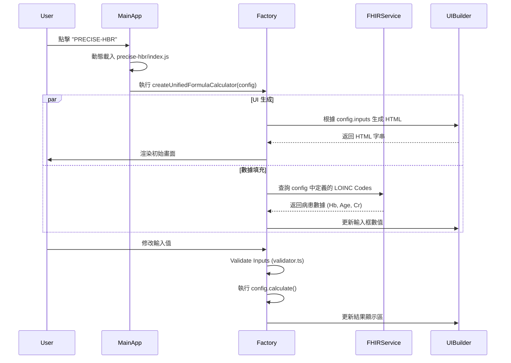

# MedCalcEHR Technical Architecture Report

## The "Calculation Software Factory" Model

### 1. 摘要 (Executive Summary)

本報告詳細闡述了 MedCalcEHR (臨床計算器平台) 的技術架構。該系統採用 **「配置驅動 (Configuration-Driven)」** 與 **「工廠模式 (Factory Pattern)」** 的混合架構設計，旨在解決傳統醫療軟體開發中「重複性高」、「維護困難」、「介面不一致」的痛點。透過將業務邏輯 (醫學公式) 與實作細節 (UI/數據串接) 分離，實現了高度可擴展且標準化的「計算器生產工廠」。

---

### 2. 方法論 (Methodology)

傳統的計算器開發方式通常為每一個計算器單獨編寫 HTML、CSS 和 JavaScript。這種方式在計算器數量達到數十甚至上百個時，會面臨巨大的維護成本。

本專案改採以下核心方法：

#### 2.1. 聲明式編程 (Declarative Programming)

開發者不再編寫「如何繪製一個輸入框」或「如何抓取 DOM 元素」的指令 (Imperative)，而是編寫「這個計算器需要什麼」的描述 (Declarative)。

- **Input**: 定義一個 JSON-like 的配置物件 (Blueprint)。
- **Output**: 由工廠函數自動生成完整的應用程式。

#### 2.2. 關注點分離 (Separation of Concerns)

- **醫學邏輯層**: 專注於公式準確性、變數定義、參考文獻。
- **基礎設施層**: 專注於 UI 渲染、錯誤處理、RWD 適配、瀏覽器兼容性。
- **數據整合層**: 專注於 FHIR 標準對接、數據緩存、單位轉換。

---

### 3. 技術詮釋 (Technical Interpretation)

#### 3.1. 核心設計模式

- **Factory Pattern (工廠模式)**: 系統使用兩大標準工廠來生產計算器。
    - **Unified Formula Factory**: 負責生產數值運算型計算器。
    - **Scoring Factory**: 負責生產評分表型計算器。
- **Strategy Pattern (策略模式)**: 針對不同的計算類型 (簡單公式 vs. 複雜評分表)，系統動態選擇不同的計算策略與渲染邏輯。
- **Observer Pattern (觀察者模式)**: 用於輸入欄位的事件監聽，當任一影響因子的值改變時，自動觸發重新計算並更新 UI。

#### 3.2. 用戶介面抽象化 (UI Abstraction)

系統引入了一個 `UIBuilder` 層。這是一個封裝了 DOM 操作的抽象層。

- **優勢**: 若未來需要更換 UI 框架 (例如從原生 JS 換成 React 或 Vue)，只需重寫 `UIBuilder`，從上百個計算器模組皆無需修改。
- **一致性**: 強制所有計算器使用相同的 Design System (字體、間距、顏色)，確保專業且一致的使用者體驗。

#### 3.3. 數據標準化與互操作性 (Interoperability)

系統深度整合 **HL7 FHIR (Fast Healthcare Interoperability Resources)** 標準。

- **自動填充 (Auto-Population)**: 每個輸入欄位可綁定 LOINC Code。工廠在初始化時，會自動透過 `FHIRDataService` 向醫院後端請求對應的檢驗數值，實現「零輸入」的計算體驗。

---

### 4. 實施細節 (Implementation Details)

#### 4.1. 架構分層

系統由下而上分為四層：

1.  **基礎服務層 (Foundation Layer)**
    - `UIBuilder`: 生成標準 HTML 元件 (Cards, Inputs, Alerts)。
    - `FHIRDataService`: 處理 API 請求、認證、數據解析。
    - `UnitConverter`: 處理不同測量單位的轉換 (如 mg/dL <-> mmol/L)。
    - `validator.ts`: 中央驗證邏輯，定義全域數值範圍。

2.  **工廠核心層 (Factory Core Layer)** - **[STANDARD]**
    - `shared/unified-formula-calculator.ts`: **(Formula Standard)** 通用公式引擎。處理數值輸入、範圍驗證、複雜公式運算。
    - `shared/scoring-calculator.ts`: **(Scoring Standard)** 評分表引擎。處理 Radio/Checkbox 邏輯、積分匯總、風險分層。

    - _Deprecated Factories_ (Do NOT use):
        - `formula-calculator.ts` (Old wrapper)
        - `radio-score-calculator.ts` (Old wrapper)

3.  **產品配置層 (Product Configuration Layer)**
    - 位於 `src/calculators/*`。
    - 每個資料夾代表一個計算器，包含 `index.ts`。
    - 僅包含配置數據 (Config) 和純函數 (Pure Function) 的計算邏輯。

4.  **應用整合層 (Application Layer)**
    - `main.ts` & `LazyLoader`: 負責路由管理與模組的動態載入 (Dynamic Import)，優化首頁加載速度。

#### 4.2. 關鍵流程圖解 (Workflow)



#### 4.3. 代碼結構範例

一個典型的計算器實作僅需定義如下結構，其餘皆由工廠自動處理：

```typescript
// 使用統一工廠標準
import {
    createUnifiedFormulaCalculator,
    LOINC_CODES
} from '../shared/unified-formula-calculator.js';

export const preciseHbr = createUnifiedFormulaCalculator({
    id: 'precise-hbr',
    title: 'PRECISE-HBR Score',
    // 定義輸入介面
    sections: [
        {
            title: 'Labs',
            fields: [
                {
                    id: 'hb',
                    label: 'Hemoglobin',
                    type: 'number',
                    loincCode: LOINC_CODES.HEMOGLOBIN, // 自動串接 FHIR
                    unitConfig: { type: 'hemoglobin' } // 自動驗證與單位轉換
                }
            ]
        }
    ],
    // 定義純計算邏輯
    calculate: values => {
        const hb = values['hb'];
        return [{ label: 'Score', value: (15 - hb) * 2.5 }];
    }
});
```

### 5. 總結 (Conclusion)

本架構成功將**「醫療專業知識」**與**「軟體工程實作」**解耦。
對於醫療人員或內容維護者，他們只需專注於驗證公式與邏輯的正確性；對於軟體工程師，則只需維護核心工廠與基礎服務的穩定性。這種架構不僅大幅提升了新功能的開發效率（從數天縮短至數小時），更確保了整個平台在擴展過程中的穩定性與一致性。
