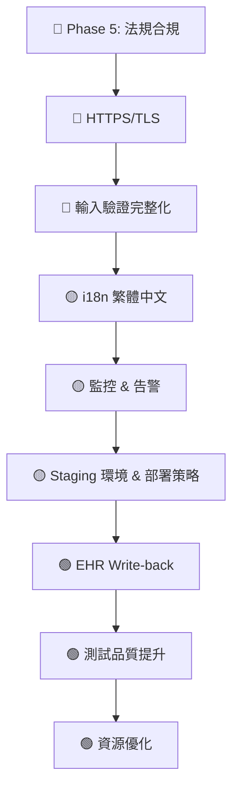

# MEDCALCEHR 產品化差距分析報告

> 基於對專案結構、程式碼、CI/CD、文件及現有 `production_roadmap.md` 的全面審查

---

## 現況評估

Phase 0–4 已完成，專案在**架構設計**、**FHIR 整合**、**安全基礎**、**測試覆蓋**、**無障礙**、**運維監控**方面有堅實基礎。以下為產品化前仍需完成的項目。

---

## 🔴 關鍵阻擋項（Must Have — 上線前必須完成）

### 1. 法規合規（Phase 5 — 完全未開始）

這是**最大的差距**，也是醫療軟體產品化的最大門檻。

| 缺失項 | 說明 | 影響 |
|--------|------|------|
| **Traceability Matrix 僅覆蓋 APACHE II** | 目前 [TRACEABILITY_MATRIX.md](file:///d:/CGHCALC/MEDCALCEHR/docs/compliance/TRACEABILITY_MATRIX.md) 只有 11 個需求，僅覆蓋 1/92 個計算器 | IEC 62304 要求完整追溯 |
| **SOUP 清單不完整** | [SOUP_LIST.md](file:///d:/CGHCALC/MEDCALCEHR/docs/compliance/SOUP_LIST.md) 僅列 5 項，缺少 `@sentry/browser`、`fuse.js`、`web-vitals`、`vite`、`playwright`、`postcss` 等 | 法規審查不過 |
| **臨床評估報告 (CER) 缺失** | 無任何臨床評估文件 | SaMD 上市必備 |
| **使用性測試未執行** | 無任何使用者測試記錄 | IEC 62366 要求 |
| **QMS 程序文件缺失** | 無品質管理系統文件 | ISO 13485 要求 |
| **法規路徑未確定** | 尚未決定 TFDA / FDA 510(k) / MDR CE | 影響所有合規策略 |
| **風險管理 (FMEA) 僅部分覆蓋** | [RISK_MANAGEMENT.md](file:///d:/CGHCALC/MEDCALCEHR/docs/compliance/RISK_MANAGEMENT.md) 需擴展至所有計算器類型 | ISO 14971 要求 |
| **SAD 安全架構章節缺失** | Software Architecture Document 不完整 | IEC 62304 要求 |

### 2. HTTPS/TLS 設定

| 缺失項 | 說明 |
|--------|------|
| **Nginx 僅監聽 port 80 (HTTP)** | [nginx.conf](file:///d:/CGHCALC/MEDCALCEHR/nginx.conf) 無 SSL 配置，`Strict-Transport-Security` header 在無 HTTPS 時無效 |
| **無 TLS 憑證管理** | 需配置 Let's Encrypt / 機構 CA 憑證 |

> [!CAUTION]
> 醫療應用處理 ePHI，**必須**全程 HTTPS。目前 HSTS header 在 HTTP-only 環境下形同虛設。

### 3. 輸入驗證完整性（延遲項）

| 缺失項 | 說明 |
|--------|------|
| **92 個計算器三區驗證覆蓋率審查** | 從 Phase 0 延至今仍未完成 |
| **FHIR 自動填入驗證** | FHIR 資料是否經過與手動輸入相同的驗證管線未確認 |

---

## 🟡 重要項目（Should Have — 上線後短期內完成）

### 4. 國際化 (i18n) — ★☆☆☆☆

| 缺失項 | 說明 |
|--------|------|
| **無翻譯框架** | 所有字串硬寫英文 |
| **無語言切換 UI** | — |
| **醫學術語翻譯** | 需臨床審查 |

> [!IMPORTANT]
> 若目標市場為台灣，繁體中文介面幾乎是必備。

### 5. 監控與告警

| 缺失項 | 說明 |
|--------|------|
| **無 Uptime Monitoring** | 無外部可用性監控（UptimeRobot / Pingdom） |
| **無告警規則** | Sentry 已整合但無 on-call 告警流程 |
| **Lighthouse CI 未配置** | `.lighthouserc.json` 存在但未納入 CI |
| **效能預算未設定** | 無 LCP / FID 等門檻 |

### 6. 部署與環境

| 缺失項 | 說明 |
|--------|------|
| **無 Staging 環境** | `docker-compose.staging.yml` 存在但未實際部署 |
| **無 Blue-Green / Canary 部署** | 單一部署策略 |
| **無 Rollback SOP** | — |
| **Docker Image 版本策略** | 目前僅 `latest` tag |
| **無 Container Registry** | CI 建置 Docker image 但未推送至 registry |

### 7. 備份與災難恢復

| 缺失項 | 說明 |
|--------|------|
| **RTO / RPO 未定義** | — |
| **災難恢復程序未文件化** | `docs/disaster-recovery.md` 存在但內容待驗證 |

---

## 🟢 次要項目（Nice to Have — 可排入後續迭代）

### 8. EHR Write-back

| 缺失項 | 說明 |
|--------|------|
| **計算結果無法寫回 EHR** | 目前為唯讀 |
| **無 FHIR Provenance 追蹤** | `provenance-service.ts` 存在(44KB)但需確認是否完整 |
| **無 CDS Hooks 整合** | — |

### 9. 測試品質進一步提升

| 缺失項 | 說明 |
|--------|------|
| **覆蓋率 53%** | 可提升至 70%+ |
| **無 Mutation Testing** | Stryker 尚未導入 |
| **臨床醫師 Code Review** | 計算公式未經醫師正式審查 |
| **E2E 僅 Chromium** | Firefox / WebKit CI 測試尚未啟用 |

### 10. 資源優化

| 缺失項 | 說明 |
|--------|------|
| **圖片未壓縮 (WebP)** | — |
| **字型未子集化** | — |
| **`connect-src` CSP 白名單** | 目前允許多個 wildcard domain |

### 11. 無障礙補強

| 缺失項 | 說明 |
|--------|------|
| **顏色對比度未全面審查** | 需人工或 Lighthouse 驗證 ≥ 4.5:1 |
| **高對比模式** | 未支援 |
| **`prefers-reduced-motion`** | 未支援 |

### 12. SOUP 版本過時風險

| 套件 | SOUP 記錄版本 | `package.json` 實際版本 |
|------|-------------|----------------------|
| `fhirclient` | `^2.5.2` (SOUP 記錄) | `^2.6.3` (實際) |

> SOUP 文件與實際版本不同步，需更新。

---

## 建議優先順序

## 預估工時

| 優先級 | 項目 | 預估工時 |
|--------|------|---------|
| 🔴 | 法規合規（Traceability × 92、CER、QMS） | 4–8 週 |
| 🔴 | HTTPS/TLS + CSP 白名單 | 1–2 天 |
| 🔴 | 輸入驗證全覆蓋 | 1–2 週 |
| 🟡 | i18n 框架 + 繁中翻譯 | 2–3 週 |
| 🟡 | 監控 & Staging 環境 | 1 週 |
| 🟡 | 部署策略 & DR 程序 | 1 週 |
| 🟢 | EHR Write-back | 2–3 週 |
| 🟢 | 測試 70%+ | 2 週 |

---

## 結論

專案技術成熟度高（Phase 0-4 已完成），**最大瓶頸在法規合規**。建議：

1. **立即啟動 Phase 5**：確定法規路徑 → 擴展 Traceability Matrix → 完善 SOUP → 撰寫 CER
2. **同步處理 HTTPS**：這是一個簡單但關鍵的安全項目
3. **視目標市場決定 i18n 優先級**：若面向台灣市場，繁中介面應與 Phase 5 並行開發
