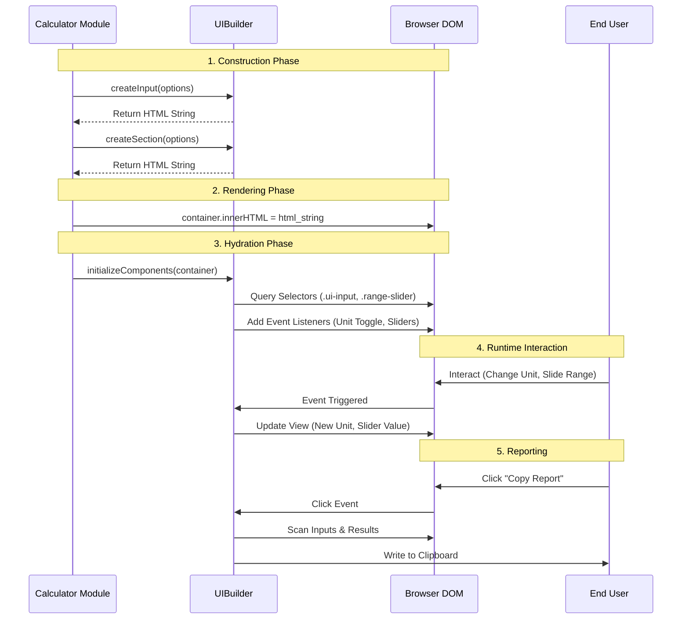

# UI Builder Architecture Analysis

## 1. Overview
`src/ui-builder.ts` is the central UI generation engine for the MEDCALCEHR application. It implements a **declarative UI pattern** where calculator interfaces are constructed via method calls and configuration objects rather than raw HTML. This ensures:
- **Consistency**: Uniform styling and behavior across all 50+ calculators.
- **Maintainability**: Centralized handling of DOM structure and CSS classes.
- **Interactivity**: Automatic binding of events for unit toggles, sliders, and selection states.

## 2. Core Architecture

### Singleton Pattern
The module exports a singleton instance `uiBuilder` (line 856), ensuring a single point of entry for all UI operations. It also exports the class `UIBuilder` for testability or isolated instances.

### Configuration-Driven Design
Every UI component is defined by a rigorous TypeScript interface (e.g., `UIInputOptions`, `UIRadioGroupOptions`). This provides compile-time safety and clear API documentation.

## 3. Component System

The `UIBuilder` provides a comprehensive suite of components categorized by function:

### 3.1 Form Controls
Standardized wrappers for HTML inputs that include labels, help text, and validation markers.
- `createInput`: Text/Number inputs with built-in unit support.
- `createRadioGroup` / `createCheckboxGroup`: Grouped selection controls.
- `createSelect`: Dropdown menus.
- `createRange`: Sliders with real-time value display.

### 3.2 Layout & Structure
- `createSection`: Collapsible/Standard containers with titles, subtitles, and icons.
- `createTable`: Data tables with optional sticky headers/columns.
- `createList`: Unordered or ordered lists.
- `createForm`: High-level wrapper to generate an entire form from an array of field configs.

### 3.3 Result Display
Specialized components for showing calculator outputs.
- `createResultBox`: Container for results with a built-in **Copy Report** feature.
- `createResultItem`: Formatted score display with value, unit, and label.
- `createAlert`: Contextual alerts (info, warning, danger, success) with icons.

### 3.4 Clinical Specifics
- `createFormulaSection`: Standardized display of mathematical formulas with LaTeX-like styling.
- `createReference`: Bibliographic citations formatting.

## 4. Advanced Features

### 4.1 Dynamic Behavior (`initializeComponents`)
The `initializeComponents` method (line 626) is the "hydrator" that brings static HTML to life. It must be called after HTML injection. It handles:
- **Unit Toggles**: Automatically enhances inputs with `data-unit-toggle` using `UnitConverter`.
- **Visual Feedback**: Adds `selected` classes to active radio/checkbox labels.
- **Copy Report**: Attaches clipboard logic to "Copy Report" buttons.
- **Range Sliders**: Binds real-time value updates to slider movement.

### 4.2 Automated Reporting (`generateReport`)
A sophisticated report generator (line 418) that traverses the DOM to construct a text summary of the calculation.
- **Intelligent Label Extraction**: Resolves labels for inputs, even finding group labels from parent sections.
- **Result Parsing**: Scrapes result values and interpretations strings.
- **Formatting**: Produces a clean, clipboard-ready text format.

## 5. Integration Points

### Unit Converter
Imports `UnitConverter` from `./unit-converter.js`.
- Used in `initializeComponents` to enable seamless unit switching logic (lines 640-645).

### CSS Architecture
Relies on a companion CSS file (`css/ui-builder.css` or embedded in `utilities.css`) for class definitions like `.ui-input-group`, `.ui-section`, etc.

## 6. Suggestions for Improvement

1.  **Validation Logic**: While `required` attributes are supported, client-side validation logic is currently delegated to the browser. A `validateForm()` method could be added.
2.  **State Management**: Currently stateless. Adding a simple state store could facilitate complex inter-field dependencies.
3.  **Template Engine**: As complexity grows, moving from string concatenation strings to a lightweight template engine (e.g., `lit-html` or similar) might improve performance and security (XSS prevention).

## 7. Operational Flowchart

The following diagram illustrates the lifecycle of a calculator interface built with `UIBuilder`.

## Summary
`ui-builder.ts` is a mature, robust foundation for the application. Its strict typing and comprehensive component set make it easy to rapidly develop new clinical calculators while maintaining a professional, uniform aesthetic.
